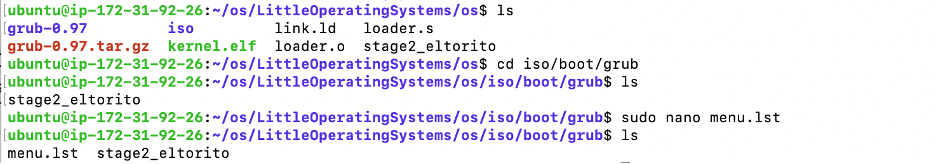

**1. Purpose of the LittleOperatingSystems**

The purpose of the LittleOperatingSystems is to act as an intermediary between hardware and software, providing a platform for applications to run efficiently and managing computer resources. It provides an interface for users to interact with the computer and ensures that hardware resources are utilized effectively by software programs.

 

**1.1 Functions of the LittleOperatingSystems**

·   Process Management: The OS manages processes, including process creation, scheduling, and termination, to ensure efficient use of CPU time.

·   Memory Management: It manages system memory, allocating memory to processes and ensuring memory protection to prevent one process from accessing another's memory.

·   File System Management: The OS provides file management functions, including:

```
Create

Update

Copy

Delete

List
```

·   Device Management: It manages devices such as printers, disks, and networks, handling device communication and ensuring efficient device utilization.

·   Security: The OS enforces security policies, controls access to system resources, and protects against unauthorized access and malware.

 

**1.2 Number of Code Lines**


The provided C++ program contains approximately 134 lines of code. It demonstrates basic file management operations (create, update, copy, delete, list) and includes a simulation of process scheduling. While it provides a simplified example, a full-fledged operating system would require millions of lines of code to implement all the necessary functionality and manage complex interactions between hardware and software. 

 In addition, there are 70 lines of code for the various configuration files.

 

**2. Setting Up Development Environment**

 

Install necessary tools and libraries:

```
sudo apt-get install build-essential nasm genisoimage qemu
```

 

·   build-essential: contains the GNU compiler collection including gcc, g++, make, etc. 

·   nasm: the Netwide Assembler, a popular assembler for x86 architecture. 

·   genisoimage: for creating ISO files for CD-ROMs.

·   qemu: a generic and open-source machine emulator and virtualizer, useful for running and testing.

 

 

**3. Compiling the Operating System and Linking the Kernel**

 

**3.1 Create loader.s file**

 

Implement bootloader functionality, preparing for kernel execution. This assembly file will serve as the bootloader, setting up essential registers and the protected mode before jumping to the kernel main function.


 

3.2 Create link.ld file**

 Define memory layout and sections for the kernel. The linker script that specifies the memory addresses where the kernel sections (text, data, bss) should be placed.


 **3.3 Create kernel.elf**

 


The final executable will be called kernel.elf, which is the entry point for the operating system.


**4. Building an ISO Image**

  **4.1 Create Directory**


**4.2 Create menu.lst Configuration for GRUB**


 Configure GRUB with necessary boot parameters and ensure it points to kernel.elf.




  **4.3 Generate ISO Image**


The ISO image os.iso now contains the kernel executable, the GRUB bootloader and the configuration file.


**5. Implementing the Shell**

**5.1 Write Makefile**


**5.2 Write Shell Program**

Develop a C++ program for the shell, parsing user commands for file operations.

**5.3 Compile the Shell Program**

**5.4 Running the Shell**

 
